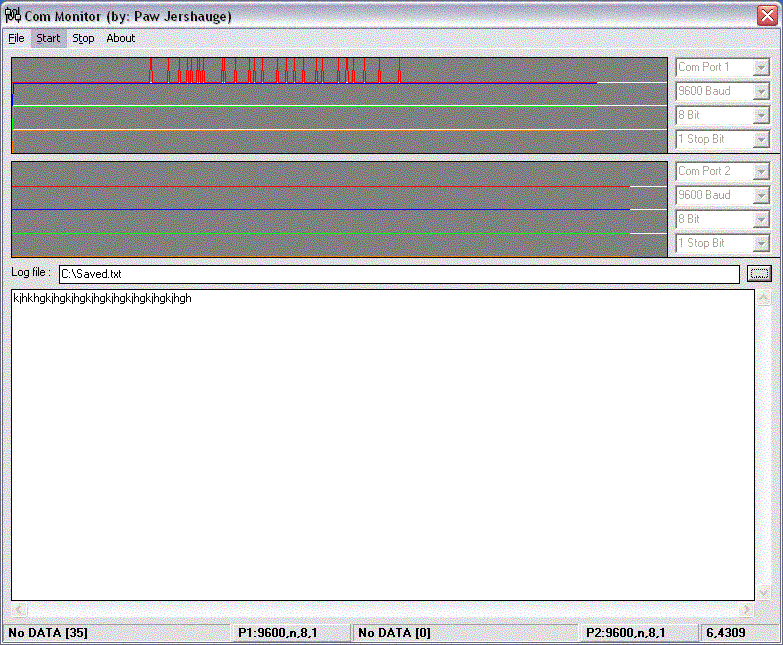



## ComPort monitor

### Description

Another way to collect information from the com port on a computer...
 
### More Info
 

             |
---                |---
**Submitted On**   |2002-03-06 14:29:34
**By**             |[Paw Jershauge](https://github.com/Planet-Source-Code/PSCIndex/blob/master/ByAuthor/paw-jershauge.md)
**Level**          |Intermediate
**User Rating**    |4.7 (28 globes from 6 users)
**Compatibility**  |VB 5\.0, VB 6\.0
**Category**       |[Miscellaneous](https://github.com/Planet-Source-Code/PSCIndex/blob/master/ByCategory/miscellaneous__1-1.md)
**World**          |[Visual Basic](https://github.com/Planet-Source-Code/PSCIndex/blob/master/ByWorld/visual-basic.md)
**Archive File**   |[ComPort\_mo59742362002\.zip](https://github.com/Planet-Source-Code/paw-jershauge-comport-monitor__1-32397/archive/master.zip)

